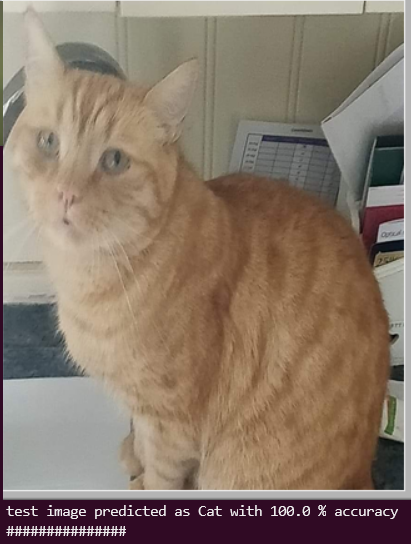

# Simple_NN
A small Python 3 project written as a stepping stone for learning the basics of convolution neural networks from first principles for another repo [Pykadex](https://github.com/Sudini1412/PykaDex). The project uses 10,000 images of cats and dogs downloaded from bing and uses them to train a simple nueral network. I have tried to write the class as flexible as possible so that it can be used to test any two categories of images not just cats and dogs.



## Basic Method
Using simple linear regression the program optimizes the w,b paramaters by passing forwards and backwards propagration in an iterative loop. 
The program uses the sigmoid activation function to classisfy an image into one of two categories values (0 or 1) that refer to a dictionary. The w,b paramaters can then be reused to test the model with a supplied image. The program `run.py` calls function from a class I have written in `Simple_NN_class.py`.

## Install
```bash
foo@bar:~$ git clone https://github.com/Shellywell123/Simple_NN
```
```bash
foo@bar:~$ cd Simple_NN/
```
```bash
foo@bar:~$ pip3 install -r requirements.txt
```

## For running the program
I recieved some runtime warnings therfore use the flag `-W ignore`.
```bash
foo@bar:~$ python3 -W ignore run.py
```
## For downloading and formating training data
The code in its current state does not download the training data nor is the data stored on the git, due to file size restrictions. However this can easily be done with supplied code in a few steps.\\

#### 1st install bing_image_downloader v1.0.2
```bash
foo@bar:~$ pip3 install bing_image_downloader==1.0.2
```
#### 2nd replace bing.py file in the package
the location of the package can be found by the command:
```bash
foo@bar:~$ pip3 show bing_image downloader
```
Open the `dir` in which the `bing_imaage_downloader` is stored in and replace the `bing.py` file with `replacement_bing1-0-2.py.` 

#### 3rd Call the `download_training_data()` funtion
Then uncomment and run the following code in `run.py.`
```python
nn = Simple_NN()

# download training data from bing
num_of_images_per_category = 10000
list_of_categories         = ['Cat','Dog']
nn.download_training_data(num_of_images_per_category,list_of_categories)

# generate .h5 formated training data file
nn.format_training_data_as_h5('dataset/bing','h5_files/training_data.h5')
```

## For importing training data and making/saving a model
```python
nn = Simple_NN()
# load training data in from .h5 file
X_training_data,Y_training_data=nn.load_h5_training_data('h5_files/training_data.h5')

# generate model and save params for testing the model
w,b =nn.model(X_training_data,Y_training_data,num_iterations=2000,learning_rate=0.5)
nn.save_model_as_h5('h5_files/model_10k.h5',w,b)
```

## For loading and testing a model
```python
nn = Simple_NN()
# load in model params
w,b = nn.load_h5_model('h5_files/model_10k.h5')

# test model with images
nn.test_image('test_images/test_image.jpg', w,b,'Cat')
nn.test_image('test_images/test_image3.jpg',w,b,'Dog')

```
## Current Results
I have passed several images of cats and dogs and thus far it only identifies cats correctly, this may be due to an error in the code, a bad testing sample or due to the simplicity of the NN itself. I will eventually add more hidden layers and deeper learning to the `Simple_NN` class.

